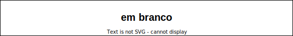

# Computação Gráfica - Unidade 3  

Interface, Transformações 2D e Seleção, Programação orientada a eventos. Elementos de interface, Eventos e atributos de elementos de interface. Funções callback (teclado e mouse). Transformações de sistemas de coordenadas Transformações geométricas 2D, Algoritmos de seleção, Boundaring Box.  

Objetivo: demonstrar conhecimento no desenvolvimento de sistemas com interface gráfica com o usuário. Interpretar, especificar e desenvolver aplicações simples com transformações geométricas.  

## Rabiscos



## Material  

[cg-slides_u3.pdf](./cg-slides_u3.pdf "cg-slides_u3.pdf")  

## [Atividades - Aula](./Atividade3/README.md "Atividades - Aula")  

[ScanLine](./ScanLine.pdf)  

<!--
## Download

Nesta pasta tem um executável da atividade 3 que pode ser usado para ajudar a entender o enunciado desta atividade.  
[CG-N3_Executavel](./CG-N3_Executavel/ "CG-N3_Executavel")  

## Dicas de código

Na Classe Mundo.cs adicione *ToolkitOptions*  

```csharp
  class Program
  {
    static void Main(string[] args)
    {
      ToolkitOptions.Default.EnableHighResolution = false;
      Mundo window = Mundo.GetInstance(600, 600);
      window.Title = "CG_N3";
      window.Run(1.0 / 60.0);
    }
  }
}
```

Já na Classe Objeto.cs o método *Desenhar()*  

```csharp
    public void Desenhar()
    {
#if CG_OpenGL
      GL.PushMatrix();                                    // N3-Exe12: grafo de cena
      GL.MultMatrix(matriz.ObterDados());
      GL.Color3(objetoCor.CorR, objetoCor.CorG, objetoCor.CorB);
      GL.LineWidth(primitivaTamanho);
      GL.PointSize(primitivaTamanho);
#endif
      DesenharGeometria();
      for (var i = 0; i < objetosLista.Count; i++)
      {
        objetosLista[i].Desenhar();
      }
      GL.PopMatrix();                                     // N3-Exe12: grafo de cena
    }
```

E ainda, na Classe Objeto.cs um exemplo de método para rotação em relação a origem do SRU  

```csharp
    public void Rotacao(double angulo)
    {
      RotacaoEixo(angulo);
      matriz = matrizTmpRotacao.MultiplicarMatriz(matriz);
    }

```

Já, na Classe Objeto.cs, um exemplo de método para rotação em torno de um ponto  

```csharp
    public void RotacaoEixo(double angulo)
    {
      switch (eixoRotacao)
      {
        case 'x':
          matrizTmpRotacao.AtribuirRotacaoX(Transformacao4D.DEG_TO_RAD * angulo);
          break;
        case 'y':
          matrizTmpRotacao.AtribuirRotacaoY(Transformacao4D.DEG_TO_RAD * angulo);
          break;
        case 'z':
          matrizTmpRotacao.AtribuirRotacaoZ(Transformacao4D.DEG_TO_RAD * angulo);
          break;
      }
    }
```

```csharp
    public void RotacaoZBBox(double angulo)
    {
      matrizGlobal.AtribuirIdentidade();
      Ponto4D pontoPivo = bBox.obterCentro;

      matrizTmpTranslacao.AtribuirTranslacao(-pontoPivo.X, -pontoPivo.Y, -pontoPivo.Z); // Inverter sinal
      matrizGlobal = matrizTmpTranslacao.MultiplicarMatriz(matrizGlobal);

      RotacaoEixo(angulo);
      matrizGlobal = matrizTmpRotacao.MultiplicarMatriz(matrizGlobal);

      matrizTmpTranslacaoInversa.AtribuirTranslacao(pontoPivo.X, pontoPivo.Y, pontoPivo.Z);
      matrizGlobal = matrizTmpTranslacaoInversa.MultiplicarMatriz(matrizGlobal);

      matriz = matriz.MultiplicarMatriz(matrizGlobal);
    }
```

----------

## ⏭ [Unidade 4)](../Unidade4/README.md "Unidade 4")  
-->
<!--
[FIXME: arrumar as fontes bibliográficas]  
## Principais Referências Bibliográficas​
-->